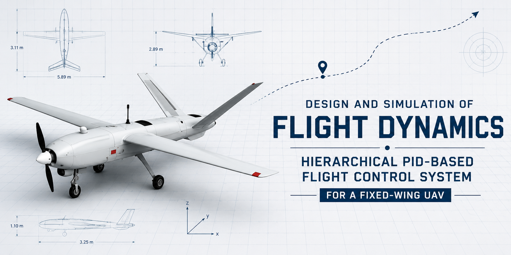

\# ✈️ Design and Simulation of Flight Dynamics and Hierarchical PID-Based Flight Control System for a Fixed-Wing UAV


<p align="center">

&#x20; 

</p>


<p align="center">


!\[Status](https://img.shields.io/badge/Status-Completed-brightgreen?style=for-the-badge)

!\[MATLAB](https://img.shields.io/badge/MATLAB-R2024a-orange?style=for-the-badge)

!\[Flight Control](https://img.shields.io/badge/Flight-Control-blue?style=for-the-badge)

!\[DRDO Internship](https://img.shields.io/badge/DRDO-Internship-darkblue?style=for-the-badge)

!\[License](https://img.shields.io/badge/License-MIT-lightgrey?style=for-the-badge)


</p>


<p align="center">

<strong>DRDO Internship Project</strong><br>

DRDO Young Scientist Laboratory – Asymmetric Technologies (DYSL-AT), Hyderabad<br>

Department of Aeronautical Engineering<br>

Hindustan Institute of Technology and Science

</p>


\---


\# 📖 Overview


This repository presents the \*\*design, modelling, simulation, and validation\*\* of a \*\*Hierarchical PID-Based Flight Control System\*\* for a fixed-wing \*\*Unmanned Aerial Vehicle (UAV)\*\* using \*\*MATLAB\*\*.


Developed during a \*\*DRDO Internship\*\*, the project implements a complete \*\*nonlinear Six-Degree-of-Freedom (6-DOF)\*\* mathematical model of the \*\*Aerosonde UAV\*\*, followed by \*\*trim analysis\*\*, \*\*state-space linearization\*\*, \*\*transfer-function development\*\*, and \*\*hierarchical autopilot design\*\* using the \*\*Successive Loop Closure (SLC)\*\* methodology.


The proposed flight control system regulates \*\*roll, course, pitch, altitude, airspeed, and sideslip\*\*, enabling stable autonomous flight while maintaining excellent command tracking and disturbance rejection under \*\*Dryden wind turbulence\*\*.


This project demonstrates the complete engineering workflow required to design and validate a fixed-wing UAV autopilot, making it a valuable reference for aerospace education, flight control research, and future autonomous flight system development.


\---


\# 📑 Table of Contents


\- \[Project Information](#-project-information)

\- \[Why This Project?](#-why-this-project)

\- \[Project Highlights](#-project-highlights)

\- \[Project Statistics](#-project-statistics)

\- \[System Architecture](#️-system-architecture)

\- \[Development Workflow](#-development-workflow)

\- \[Repository Structure](#-repository-structure)

\- \[Simulation Results](#-simulation-results)

\- \[Requirements](#-requirements)

\- \[Installation](#️-installation)

\- \[Quick Start](#️-quick-start)

\- \[Software \& Tools](#️-software--tools)

\- \[Skills Demonstrated](#-skills-demonstrated)

\- \[Applications](#-applications)

\- \[Future Work](#-future-work)

\- \[Technical Report](#-technical-report)

\- \[Author](#-author)

\- \[Acknowledgements](#-acknowledgements)

\- \[License](#-license)


\---


\# 📌 Project Information


| Item | Details |

|------|---------|

| \*\*Project Title\*\* | Design and Simulation of Flight Dynamics and Hierarchical PID-Based Flight Control System for a Fixed-Wing UAV |

| \*\*Organization\*\* | DRDO Young Scientist Laboratory – Asymmetric Technologies (DYSL-AT), Hyderabad |

| \*\*Internship\*\* | DRDO Summer Internship |

| \*\*Aircraft Model\*\* | Aerosonde UAV |

| \*\*Development Platform\*\* | MATLAB |

| \*\*Flight Controller\*\* | Hierarchical PID |

| \*\*Design Methodology\*\* | Successive Loop Closure (SLC) |


\---


\# 🌟 Why This Project?


Fixed-wing UAVs exhibit highly nonlinear behaviour due to aerodynamic coupling, propulsion dynamics, gravitational effects, and atmospheric disturbances. Designing a reliable flight controller therefore requires much more than simply tuning a PID controller.


This project demonstrates the complete engineering workflow used in modern flight control system development—from aircraft mathematical modelling and trim analysis to controller design, nonlinear simulation, and performance validation.


The resulting simulation framework provides a modular foundation for future research involving advanced flight control techniques such as \*\*LQR\*\*, \*\*Model Predictive Control (MPC)\*\*, \*\*Adaptive Control\*\*, and \*\*AI-based Flight Control Systems\*\*.


\---


\# ✨ Project Highlights


\- ✈️ Nonlinear \*\*6-DOF Aircraft Dynamics Model\*\*

\- 📐 Newton–Euler Aircraft Mathematical Model

\- 📊 Aircraft Trim Analysis

\- 📉 State-Space Linearization

\- 📈 Transfer Function Development

\- 🎯 Hierarchical PID Flight Controller

\- 🔄 Successive Loop Closure (SLC)

\- 🌪️ Dryden Wind Turbulence Simulation

\- 🛩️ Closed-Loop Flight Validation

\- 💻 MATLAB-Based Simulation Framework


\---


\# 📊 Project Statistics


| Category | Value |

|----------|-------|

| \*\*Aircraft Model\*\* | Aerosonde UAV |

| \*\*Flight Dynamics\*\* | Nonlinear 6-DOF |

| \*\*Flight Controller\*\* | Hierarchical PID |

| \*\*Design Methodology\*\* | Successive Loop Closure (SLC) |

| \*\*Wind Model\*\* | Dryden Turbulence |

| \*\*Numerical Solver\*\* | Fourth-Order Runge–Kutta (RK4) |

| \*\*Programming Language\*\* | MATLAB |


\---


\# 🎯 Key Outcomes


The developed flight control system successfully demonstrates:


\- ✅ Stable autonomous flight

\- ✅ Accurate airspeed regulation

\- ✅ Smooth altitude tracking

\- ✅ Reliable course tracking

\- ✅ Stable roll and pitch control

\- ✅ Coordinated flight through sideslip regulation

\- ✅ Effective atmospheric disturbance rejection

\- ✅ Modular architecture for future flight control research


\---


\# 🏗️ System Architecture


The developed flight control system follows a \*\*Hierarchical PID Autopilot\*\* based on the \*\*Successive Loop Closure (SLC)\*\* methodology. The controller is organized into multiple nested feedback loops, allowing the aircraft to maintain stable flight while accurately tracking airspeed, altitude, course, and attitude commands.


<p align="center">

&#x20; 

</p>


The controller consists of six interconnected feedback loops.


| Controller | Controlled Variable | Primary Control Surface |

|------------|---------------------|-------------------------|

| Roll Hold | Roll Angle | Aileron |

| Course Hold | Course Angle | Roll Command |

| Pitch Hold | Pitch Angle | Elevator |

| Altitude Hold | Altitude | Pitch Command |

| Airspeed Hold | Airspeed | Throttle |

| Sideslip Hold | Sideslip Angle | Rudder |


The hierarchical structure separates fast inner stabilization loops from slower outer guidance loops, simplifying controller tuning while improving overall flight stability.


\---


\# 🔄 Development Workflow


The project follows the standard workflow adopted in fixed-wing aircraft flight control system design.


<p align="center">

&#x20; 

</p>


```text

Aircraft Mathematical Model

&#x20;           │

&#x20;           ▼

&#x20;Nonlinear Flight Dynamics

&#x20;           │

&#x20;           ▼

&#x20;     Trim Analysis

&#x20;           │

&#x20;           ▼

&#x20;Aircraft Linearization

&#x20;           │

&#x20;           ▼

Transfer Function Development

&#x20;           │

&#x20;           ▼

Hierarchical PID Design

&#x20;           │

&#x20;           ▼

&#x20;Closed-Loop Simulation

&#x20;           │

&#x20;           ▼

Performance Evaluation

```


Each stage builds upon the previous one, resulting in a complete simulation framework capable of modelling, controlling, and validating a fixed-wing UAV.


\---


\# 📂 Repository Structure


```text

MATLAB-UAV-Flight-Control-System/

│

├── chap2/              Aircraft Visualization

├── chap3/              Flight Dynamics

├── chap4/              Trim \& Linearization

├── chap5/              Controller Design

├── chap6/              Autopilot Simulation

│

├── images/             Figures \& README Assets

├── results/            Simulation Outputs \& Videos

├── report/             Final Technical Report

│

├── parameters/         Aircraft Parameters

├── tools/              Utility Functions

├── message\_types/      Message Definitions

│

├── README.md

└── LICENSE

```


\---


\# 📦 Repository Contents


The repository contains all resources required to reproduce the project.


| Folder | Description |

|---------|-------------|

| \*\*chap2\*\* | Aircraft visualization and coordinate transformations |

| \*\*chap3\*\* | Nonlinear aircraft dynamics and wind simulation |

| \*\*chap4\*\* | Trim computation and state-space linearization |

| \*\*chap5\*\* | Transfer-function extraction and controller design |

| \*\*chap6\*\* | Hierarchical PID autopilot and closed-loop simulation |

| \*\*images\*\* | Figures used in the README |

| \*\*results\*\* | Simulation plots, videos, and generated outputs |

| \*\*report\*\* | Complete internship report and documentation |


\---


\# 📖 Project Workflow Summary


The repository demonstrates the complete lifecycle of a fixed-wing flight control system:


\- Develop a nonlinear \*\*6-DOF aircraft model\*\*

\- Compute steady-flight \*\*trim conditions\*\*

\- Linearize the nonlinear model

\- Derive aircraft transfer functions

\- Design a \*\*Hierarchical PID Autopilot\*\*

\- Validate the controller using nonlinear simulations

\- Evaluate tracking performance and disturbance rejection


This modular workflow makes the project suitable for both academic learning and future research in advanced UAV flight control.


\---


\# 📈 Simulation Results


The developed \*\*Hierarchical PID Flight Controller\*\* was validated through nonlinear closed-loop simulations using the \*\*Aerosonde UAV\*\* model under \*\*Dryden Wind Turbulence\*\*.


The controller was evaluated based on its ability to:


\- Maintain stable autonomous flight

\- Track commanded flight conditions

\- Reject atmospheric disturbances

\- Produce smooth transient responses

\- Maintain accurate steady-state performance


The following results demonstrate the effectiveness of the proposed flight control architecture.


\---


\# ✈️ Flight Response Analysis


\## Longitudinal Control Performance


<table>

<tr>


<td align="center" width="50%">


\*\*Airspeed Tracking\*\*


</td>


<td align="center" width="50%">


\*\*Altitude Tracking\*\*


</td>


</tr>

</table>


The longitudinal controller successfully regulates both \*\*airspeed\*\* and \*\*altitude\*\* through coordinated throttle and elevator control.


The aircraft reaches the commanded airspeed of \*\*28 m/s\*\* in approximately \*\*6.24 seconds\*\* with minimal overshoot while maintaining smooth altitude tracking and stable longitudinal dynamics.


\---


\## Lateral-Directional Control Performance


<table>

<tr>


<td align="center" width="50%">


\*\*Course Tracking\*\*


</td>


<td align="center" width="50%">


\*\*Roll Response\*\*


</td>


</tr>

</table>


The lateral-directional controller accurately follows the commanded course by generating smooth roll commands.


The roll controller rapidly stabilizes the aircraft while maintaining coordinated turns and excellent lateral stability throughout the simulation.


\---


\## Aircraft Stability


<table>

<tr>


<td align="center" width="50%">


\*\*Pitch Response\*\*


</td>


<td align="center" width="50%">


\*\*Sideslip Regulation\*\*


</td>


</tr>

</table>


The pitch controller provides stable longitudinal attitude regulation, while the sideslip controller minimizes lateral aerodynamic disturbances through rudder control, ensuring coordinated and stable flight.


\---


\# 🛰️ Three-Dimensional Flight Trajectory


<p align="center">


</p>


The simulated trajectory confirms that the aircraft successfully tracks the commanded flight profile while simultaneously regulating airspeed, altitude, attitude, and course. The overall flight path demonstrates smooth manoeuvres and stable nonlinear closed-loop operation.


\---


\# 📊 Performance Summary


| Metric | Result |

|---------|:------:|

| Aircraft Model | Aerosonde UAV |

| Trim Airspeed | \*\*25 m/s\*\* |

| Commanded Airspeed | \*\*28 m/s\*\* |

| Airspeed Settling Time | \*\*≈ 6.24 s\*\* |

| Maximum Overshoot | \*\*≈ 0.27 %\*\* |

| Final Airspeed Error | \*\*≈ 0.083 m/s\*\* |

| Mean Altitude Tracking Error | \*\*≈ 10.07 m\*\* |

| Mean Course Tracking Error | \*\*≈ 14.22°\*\* |

| Flight Stability | ✅ Stable |

| Disturbance Rejection | ✅ Successful |


The simulation results demonstrate that the proposed \*\*Hierarchical PID Flight Controller\*\* provides accurate command tracking, smooth transient behaviour, and robust disturbance rejection while maintaining stable autonomous flight.


\---


\# 🎥 Demonstration


The repository includes real-time simulation videos that provide a visual demonstration of the developed flight control system.


| Video | Description |

|--------|-------------|

| \*\*AircraftViewer.mp4\*\* | Three-dimensional visualization of the UAV during nonlinear closed-loop flight simulation. |

| \*\*DataViewer.mp4\*\* | Real-time aircraft states, control inputs, and controller responses throughout the simulation. |


These demonstrations complement the simulation plots by illustrating the aircraft's dynamic behaviour and validating the overall performance of the hierarchical autopilot.


\---


\# 🎯 Validation Summary


The developed flight control system successfully demonstrates:


\- ✅ Stable autonomous flight

\- ✅ Accurate airspeed regulation

\- ✅ Smooth altitude tracking

\- ✅ Reliable course following

\- ✅ Stable roll and pitch dynamics

\- ✅ Coordinated flight through sideslip regulation

\- ✅ Robust performance under atmospheric disturbances


Overall, the project validates the effectiveness of the \*\*Successive Loop Closure (SLC)\*\* methodology for fixed-wing UAV autopilot design and provides a modular foundation for future research involving \*\*LQR\*\*, \*\*Model Predictive Control (MPC)\*\*, \*\*Adaptive Control\*\*, and \*\*AI-based Flight Control Systems\*\*.


\---


\# 📋 Requirements


Before running the project, ensure the following software is installed:


| Software | Version |

|----------|---------|

| MATLAB | R2024a (or compatible) |

| Aerospace Toolbox | Installed |

| Control System Toolbox | Installed |

| Optimization Toolbox | Installed |


> \*\*Note:\*\* The project is based on the \*\*MAVSIM MATLAB framework\*\* developed alongside \*Small Unmanned Aircraft: Theory and Practice\* by Beard \& McLain.


\---


\# ⚙️ Installation


Clone the repository:


```bash

git clone https://github.com/amaranenivinitha/MATLAB-UAV-Flight-Control-System.git

```


Navigate to the project directory:


```bash

cd MATLAB-UAV-Flight-Control-System

```


Open MATLAB and add the project folders to the MATLAB search path.


\---


\# ▶️ Quick Start


Run the complete flight control simulation:


```matlab

mavsim\_chap6

```


The simulation automatically:


\- Loads the Aerosonde UAV parameters

\- Computes the trim condition

\- Initializes the nonlinear aircraft model

\- Starts the Dryden wind turbulence model

\- Executes the Hierarchical PID Autopilot

\- Launches the aircraft visualization

\- Displays real-time flight data


\---


\# 🛠️ Software \& Tools


| Software | Purpose |

|----------|---------|

| MATLAB | Flight dynamics modelling \& simulation |

| MAVSIM Framework | UAV simulation framework |

| Aerospace Toolbox | Flight dynamics utilities |

| Control System Toolbox | Controller design \& analysis |

| Optimization Toolbox | Aircraft trim computation |


\---


\# 🎓 Skills Demonstrated


This project demonstrates practical experience in:


\- Aircraft Flight Dynamics

\- Aircraft Stability \& Control

\- Nonlinear Aircraft Modelling

\- Six-Degree-of-Freedom (6-DOF) Dynamics

\- Aircraft Trim Analysis

\- State-Space Linearization

\- Transfer Function Development

\- Hierarchical PID Controller Design

\- Successive Loop Closure (SLC)

\- Numerical Simulation using RK4

\- MATLAB Programming


\---


\# 🌍 Applications


The developed simulation framework can be extended to support research and development in:


\- Fixed-Wing UAV Flight Control

\- Aircraft Stability Analysis

\- Guidance, Navigation \& Control (GNC)

\- Flight Controller Validation

\- Autonomous Flight Research

\- Aerospace Education

\- UAV Rapid Prototyping

\- Advanced Control System Development


\---


\# 🚀 Future Work


The modular architecture of this project enables several future extensions.


\### Advanced Flight Control


\- Linear Quadratic Regulator (LQR)

\- Model Predictive Control (MPC)

\- Adaptive Control

\- Robust Control

\- Sliding Mode Control


\### Artificial Intelligence


\- Reinforcement Learning-Based Flight Control

\- Neural Network Controllers

\- Intelligent Gain Scheduling

\- AI-Augmented Autopilot


\### Simulation \& Validation


\- FlightGear Integration

\- PX4 Software-in-the-Loop (SITL)

\- Hardware-in-the-Loop (HIL)

\- Software-in-the-Loop (SIL)

\- Real-Time Embedded Deployment


\---


\# 📘 Technical Report


A detailed internship report is available in:


📄 \*\*report/Final\_Report.pdf\*\*


The report includes:


\- Aircraft Mathematical Modelling

\- Flight Dynamics

\- Trim Analysis

\- State-Space Linearization

\- Transfer Function Development

\- Hierarchical PID Controller Design

\- Controller Gain Calculation

\- Simulation Methodology

\- Results \& Performance Evaluation


Readers interested in the theoretical background, mathematical derivations, and implementation details are encouraged to refer to the complete report.


\---


\# 👨‍💻 Author


\## \*\*Amaraneni Vinitha\*\*


\*\*B.Tech – Aeronautical Engineering\*\*


Hindustan Institute of Technology and Science


\### Research Interests


\- Flight Dynamics

\- Flight Control Systems

\- Guidance, Navigation \& Control (GNC)

\- UAV Systems

\- Autonomous Flight

\- Artificial Intelligence for Aerospace

\- Spacecraft Attitude Dynamics \& Control


\---


\# 🙏 Acknowledgements


This work was completed during an internship at the \*\*DRDO Young Scientist Laboratory – Asymmetric Technologies (DYSL-AT), Hyderabad\*\*.


I sincerely thank \*\*Mr. V. V. S. M. S. Ganesh (Scientist-C)\*\* for his guidance, technical mentorship, and continuous encouragement throughout the project.


I also extend my gratitude to the Department of Aeronautical Engineering, Hindustan Institute of Technology and Science, for providing the academic foundation that supported this work.


\---


\# 📄 License


This repository is intended for \*\*academic, educational, and research purposes\*\*.


If you use this work in your own research or learning, please provide appropriate attribution.


\---


<p align="center">


\## ⭐ If you found this repository useful, consider giving it a star!


It helps others discover the project and supports future development.


\### \*\*Model • Simulate • Control • Validate\*\*


</p>

